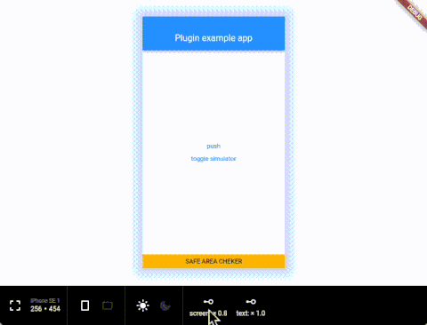

# LayoutSimulator

This package is inspired by [DeviceSimulator](https://pub.dev/packages/device_simulator).  
LayoutSimulator can simulate app layout with any screen size, orientation and text scale.



## Getting Started
```dart
import 'package:flutter/foundation.dart';
import 'package:flutter/material.dart';

import 'package:layout_simulator/layout_simulator.dart';

void main() {
  runApp(MyApp());
}

class MyApp extends StatefulWidget {
  @override
  _MyAppState createState() => _MyAppState();
}

class _MyAppState extends State<MyApp> {
  ThemeMode _themeMode = ThemeMode.system;
  bool isEnabled = true;

  @override
  Widget build(BuildContext context) {
    return MaterialApp(
      theme: ThemeData.light(),
      darkTheme: ThemeData.dark(),
      themeMode: _themeMode,
      home: FirstPage(),
      builder: (context, child) {
        if (kDebugMode) {
          return LayoutSimulator(
            enable: isEnabled,
            child: child ?? SizedBox(),
            onChangedThemeMode: (themeMode) {
              setState(() {
                this._themeMode = themeMode;
              });
            },
          );
        } else {
          return child ?? SizedBox();
        }
      },
    );
  }
}
```